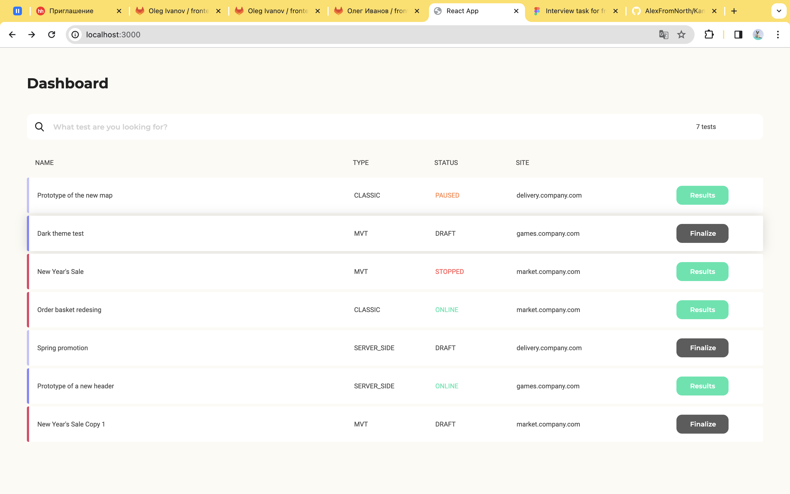
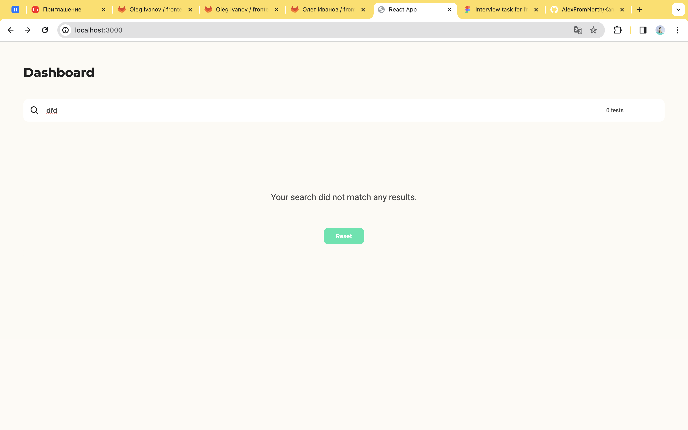
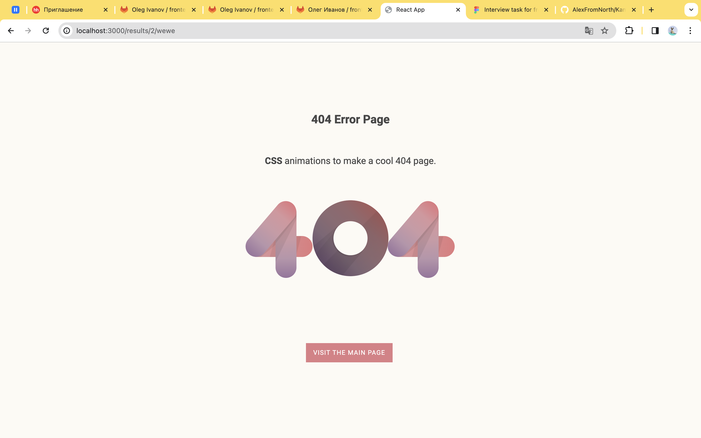

# Проект [Kameleoon](https://github.com/AlexFromNorth/Kameleoon_TZ) | Frontend / Api

### 📜 Описание:
Single Page Application для получения и фильтрации данных с Api. Созданно с применением `Create React App` и имеет переиспользуемые компоненты. 
В данном приложение возможно переходить между страницами без перезагрузки и возвращаться на предыдущую, использовать поиск.
Данный функционал реализован на TypeScript и React Hooks, так же применены регулярные выражения для фильтрации.
При переходе на несуществующую страницу будет показана страница "404 ошибка".
Добавлен инкапсулированный css.

### 📲 Как пользоватся:
* Возможно отсортировывать (ask/desk) по категориями Name, Type, Status, Site.
* Возможно переходить между страницами /, Results, Finalize и обратно.
* Используйте поиск при необходимости, uppercase не влияет.


### 🥞 Стек:

`HTML5` `CSS3` `React` `TypeScript` `axios`

### 💽 Установка и запуск:

1. Склонировать репозиторий c данными:

```git clone https://development.kameleoon.net/oivanov/frontend-interview-task-api.git ```

2. Установить зависимости:

```npm install```

3. Запустить проект в режиме разработки:

```npm start```

-----

4. Склонировать репозиторий c проектом:

```git clone https://github.com/AlexFromNorth/Kameleoon_TZ.git ```

5. Установить зависимости:

```npm install```

6. Запустить проект:

```npm start```


<br />
<br />

<br />
<br />

<br />
<br />

<br />
<br />

<br />
<br />
